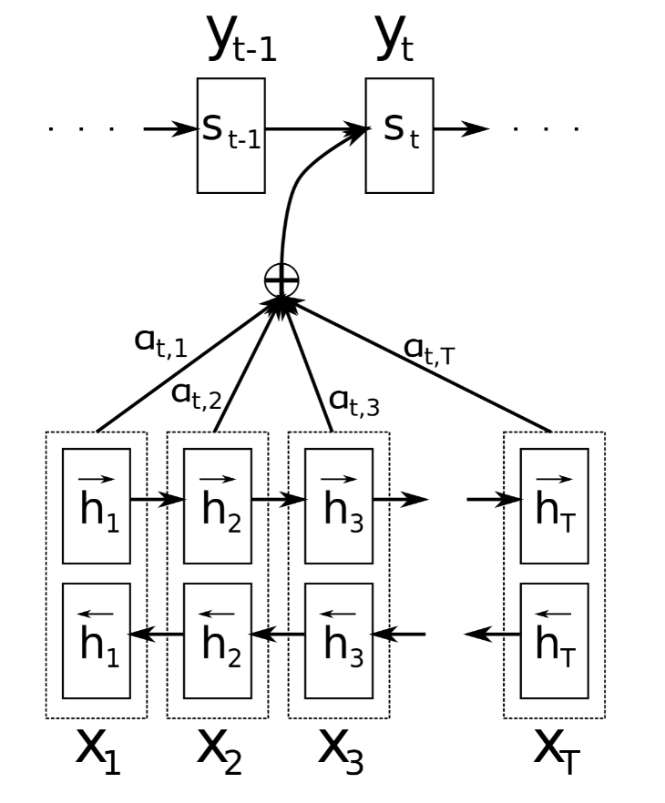
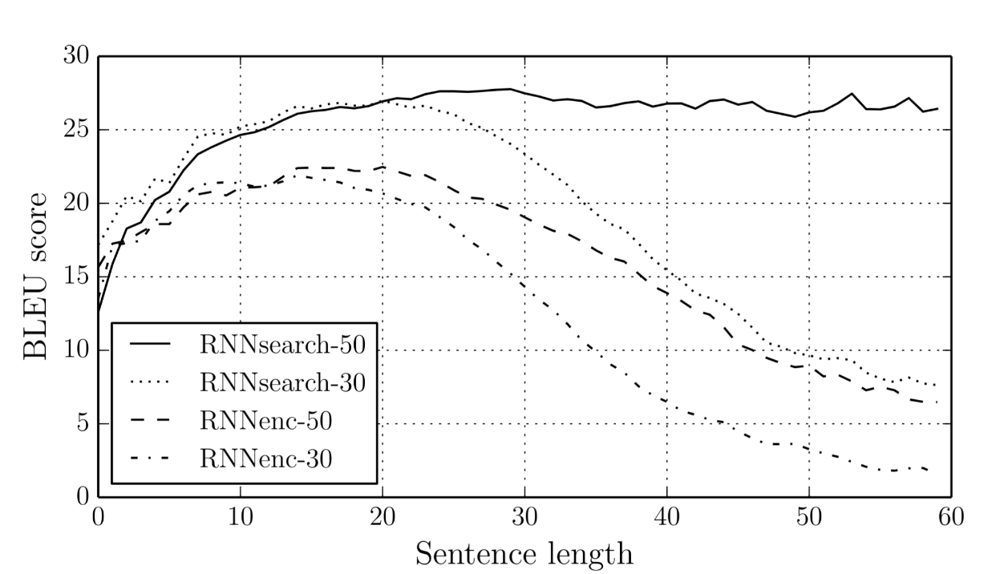
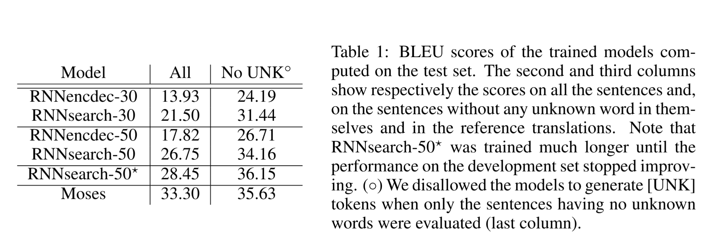
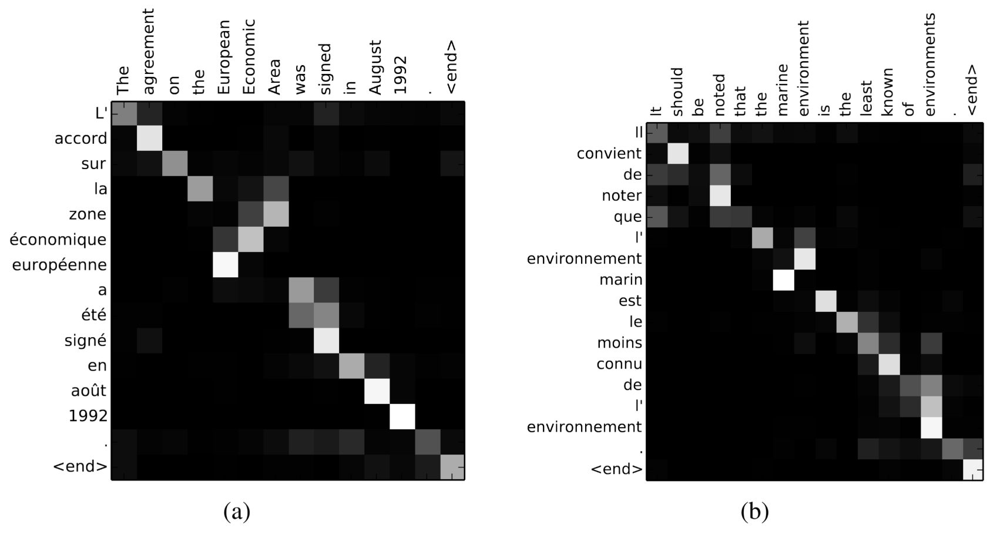
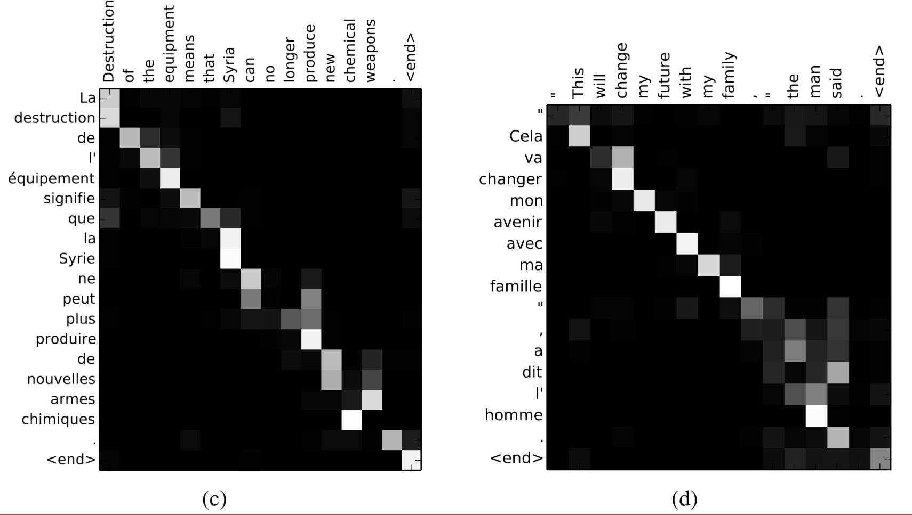

# Neural Machine Translation By Jointly Learning To Align And Translate (2016)

## Club de Lectura de NLP 2026

- Presenta: Diego Barriga
- Laboratorio L52+, IIMAS

## Contexto historico

- En ese momento (2016) la traducción automática neuronal (*Neural Machine Translation*) comenzó a ser [la novedad](https://blog.google/products-and-platforms/products/translate/found-translation-more-accurate-fluent-sentences-google-translate/).
- Hasta entonces se utilizaban arquitecturas **encoder-decoder** que codificaban las palabras de entrada en un vector **estático**
- El decodificador debía tomar este vector y generar la traducción

<center>
    
</center>

## Contribución del paper

- Los autores proponen que un vector de contexto estático es un **cuello de botella**.
- Proponen un método para que la máquinaria **preste atención** a ciertas partes de la oración. Una suerte de búsqueda suave no dirigida.
- Ponen a prueba su arquitectura en la tarea de traducción automática del Inglés->Fránces

## Arquitectura *Seq2Seq*

Las arquitecturas Seq2Seq buscan transformar una secuencia de tokens de entrada en otra secuencia de tokens a la salida

<center>


> Tomadas de Lena Voita - https://lena-voita.github.io/nlp_course/seq2seq_and_attention.html
</center>

#### Ejemplos

- Traducción entre lenguas naturales
- Tráducción entre [lenguajes de programación](https://ai.meta.com/blog/deep-learning-to-translate-between-programming-languages/).
- ?

### Formulación


Dada una entrada $x_1, x_2,...,x_n$ y una salida $y_1,y_2,...,y_m$ (notemos que $n != m$), la transformación puede verse como la búsqueda de la secuencia de salida ($y$) más probable dada la entrada ($x$) con ciertos parámetros $\theta$.

$$
y' = \underset{y}{\mathrm{argmax}} \ p(y|x, \theta)
$$

## **encoder-decoder**

La forma más habitual de modelar una arquitectura **Seq2Seq** es mediande un **encoder-decoder**. Este *framework* tiene dos partes:

1. endoder: Lee la secuencia de entrada y produce una representación vectorial
2. decoder: Usa la representación del encoder y genera la secuencia de salida

<center>
    
</center>

## Los modelos Seq2Seq son modelos del lenguaje (LMs)

- En un modelo del lenguaje se busca estimar la probabilidad de cuerta secuencia $p(\mathbf{y})$ dónde $\mathbf{y} = (y_1,y_2,..y_m)$.
- Por otro lado, los modelos seq2seq estiman la probabilidad condicional $p(y|x)$ de la secuencia y dada la fuente x.

$$
\begin{align}
p(y_1,...,y_n) = \prod_{t=1}^n p(y_t|y_{<t})\\
p(y_1,...,y_n|x) = \prod_{t=1}^n p(y_t|y_{<t},x)
\end{align}
$$

<center>
<video width="800" height="300" src="https://lena-voita.github.io/resources/lectures/seq2seq/general/enc_dec_prob_idea.mp4" controls>
<center/>

- Dado que la unica diferencia con LM es la fuente $x$, el modelado y entrenamiento son muy similares. Una visión general podría ser la siguiente:
    - La fuente y las salidas previamente generadas entran a la red
    - Obtener la representación vectorial contextual (de la fuente y el contexto previo) del decoder
    - Con base en esta representación, predecir la probabilidad 

<center>
    
</center>

## El modelo mas simple: Dos *Recurren Neural Nets, (RNNs)*

La forma más simple de un modelo *encoder-decoder* esta compuesto de dos *RNNs*: una para el encoder y otra para el decoder.

### Pero... ¿Qué es un *RNN*?

En una *RNN* es una red que tiene **ciclos en las conexiones de la red**, lo que quiere decir que el valor de alguna unidad dependerá directa o indirectamente de sus salidas y entradas previas.

<center>
    
</center>

Recordemos que el encoder lee la secuencia de entrada $x = (x_1,...,x_n)$ y condensa la información en un vector de contexto $c$. Esto sería:

$$
\begin{align}
h_t = f(x_t,h_{t-1})\\
c = q({h_1,...,h_t})
\end{align}
$$

donde $h_t \in \mathbb{R}^n$ es un estado oculto en el tiempo $t$, y $c$ es el vector de contexto generado a partir de los estados ocultos. $f$ y $q$ son dos funciones no líneales.

<center>
<video width="800" height="300" src="https://lena-voita.github.io/resources/lectures/seq2seq/general/seq2seq_training_with_target.mp4" controls>
<center/>

## De vuelta al paper

La arquitectura propuesta consiste en una *RNN* bidireccional como encoder y decoder que **simula la búsqueda en la secuencia de entrada durante la fase de decoding (traducción)**.

<center>


> Ilustración del modelo propuesto tratando de generar el token th dada la entrada x
</center>

En esta nueva arquitectura, la probabilidad condicional se modela:

$$
p(y_t|y_1,...,y_{t-1},\mathbf{x}) = g(y_{t-1},s_t,c_t)
$$

donde $s_i$ es el estado oculto de la *RNN* para el tiempo $t$ computado por:

$$
s_t = f(s_{t-1},y_{t-1},c_t)
$$

Notemos que, a diferencia de otras arquitecturas RNN, esta probabilidad está **condicionada sobre diferentes vectores de contexto $c_t$ para cada salida $y_t$**. 

### El vector de contexto $c_t$

- Este vector de contexto depende de una secuencia de *anotaciones* $(h_1,...,h_{T_{x}})$ desde donde el encoder mapea la secuencia de entrada.
- Cada anotación $h_i$ tendrá información acerca de toda la secuencia de entrada con **fuerte foco en las partes que rodean la $i-th$ palabra de la secuencia de entrada**.

El vector $c_i$ se calcula como la **suma pesada** de las anotaciones $h_i$:

$$
c_i = \sum_{j=1}^{T_x}\alpha_{ij}h_{j}
$$

El peso $\alpha_{ij}$ para cada anotación $h_j$ se calcula como:

$$
\alpha_{ij}=\frac{exp(e_{ij})}{\sum_{k=1}^{T_x}exp(e_{ik})}
$$

dónde:

$$
e_{ij} = a(s_{i-1},h_j)
$$

es un *modelo de alineación* que califica que tan buen *match* hacen las palabras de entrada en la posición $j$ y las palabras de salida $i$.

> Este modelo de alineación $a$ es una red neuronal *feedforward* que es entrenada conjuntamente con todos los otros componentes.

## Atención!, atención!

- Tomar la suma pesada de las anotaciones ($h$) como calcular una *anotación esperada*, donde se consideran todas las posibles alineaciones entre la entrada y la salida.
- El peso $\alpha_{ij}$, y su energía $e_{ij}$ asociada, reflejan la importancia de la anotación $h_j$, con respecto a los estados ocultos previos ($s_{i-1}$) en la decición del siguiente estado oculto $s_i$ y en la generación de la palabra de salida $y_i$.

### Esto mis camarada es un mecanismo de atención
<center>

</center>

## Corpus

- Corpus paralelo Inglés-Frances tomado del *ACL WMT* 2024 - https://www.statmt.org/wmt14/translation-task.html
- Contiene 850M de palabras pero despues de preprocesamiento dejaron 348M

### Modelos

- RNN encoder-decoder aka `RNNenc-*` entrenado con oraciones de hasta 30 y 50 palabras
- RNN con atención aka `RNNsearch-*` entrenado con oraciones de hasta 30 y 50 palabras

<center>


> BLEU score de las traducciones generadas con respecto a su longitud
</center>

### *BiLingual Evaluation Understudy, BLEU*

Es una métrica usada para evaluar que tan buenas son las traducciones automáticas generadas por un modelo. Mide la diferencia entra la traducción generada y la traducción creada por un humano.


```python
import sacrebleu

def evaluar_traduccion(referencia, hipotesis):
    # sacrebleu espera:
    # 1. Las hipótesis (traducciones del modelo)
    # 2. Las referencias como una lista de listas (cada sublista es un conjunto de referencias).    
    bleu = sacrebleu.sentence_bleu(hipotesis, [referencia])
    chrf = sacrebleu.CHRF()
    ch = chrf.sentence_score(hypothesis=hipotesis, references=[referencia])
    
    print(f"Referencia: {referencia}")
    print(f"Modelo:     {hipotesis}")
    print(f"BLEU score: {bleu.score:.2f}") 
    print(f"CHRF: {ch.score:.2f}\n")
```


```python
original = "me gustan las tortugas"

ref_text = "i like turtles"

hip_buena = "i like turtle"

hip_mala = "i like these tortas"

hip_perfecta = "i like turtles"

print(f"Original: {original}\n")
evaluar_traduccion(ref_text, hip_buena)
evaluar_traduccion(ref_text, hip_mala)
evaluar_traduccion(ref_text, hip_perfecta)
```

## Resultados

### Cuantitativos




### Cualitativos

<center>
    
</center>

<center>
    
</center>

### Oraciones largas

- `Original`: *An admitting privilege is the right of a doctor to admit a patient to a hospital or a medical centre to carry out a diagnosis or a procedure, based on his status as a health care worker at a hospital.*
- `RNNenc-50`: *Un privilège d’admission est le droit d’un médecin de reconnaître un patient à l’hôpital ou un centre médical <u>d’un diagnostic ou de prendre un diagnostic en fonction de son  état de santé.</u>*
- `RNNsearch-50`: *Un privilège d’admission est le droit d’un médecin d’admettre un patient à un hôpital ou un centre médical <u>pour effectuer un diagnostic ou une procédure, selon son statut de travailleur des soins de santé à l’hôpital.</u>*

## Conclusiones

- **Limitación del modelo tradicional:** El enfoque convencional de codificador-decodificador falla al traducir frases largas debido al uso de un vector de contexto de longitud fija.


- **Propuesta de RNNsearch:** Se introduce una nueva arquitectura que realiza una búsqueda (soft-search) de palabras clave en la entrada para generar cada palabra del objetivo, permitiendo que el modelo se enfoque solo en la información relevante.


- **Resultados superiores:** RNNsearch supera significativamente al modelo tradicional en traducción inglés-francés, mostrando una mayor robustez ante la longitud de las oraciones y una alineación precisa entre palabras.


- **Impacto:** El sistema alcanza un rendimiento comparable a la traducción estadística basada en frases y se plantea como un avance prometedor, aunque aún debe mejorar la gestión de palabras raras o desconocidas.

> Se los pedi a `gemma4:31b` perdon :(

## Related works

TODO
